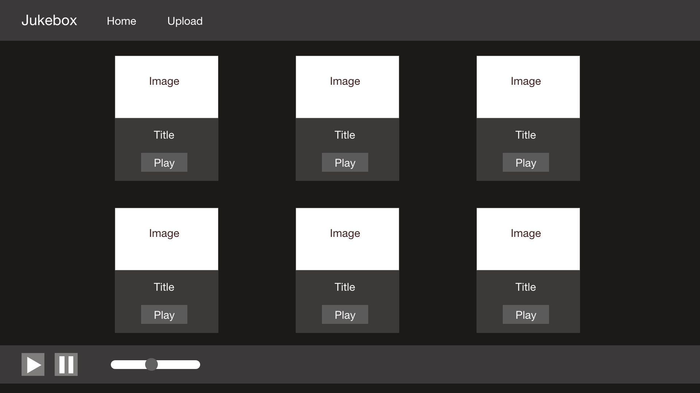
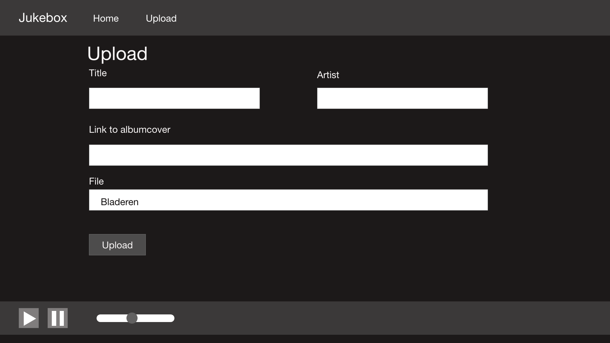

# Internet of Things:

 


## Makerslab

 

[https://vimeo.com/424051429](https://vimeo.com/424051429)

 


# Discover:

 

Voor de opdracht van internet of things in jaar 2 van ons New Media Development traject was het de bedoeling dat we een project maakte met behulp van onze net aangeschafte Raspberry Pi 4. Gezien heel onze groep (Arne & ik) enorm geïnteresseerd zijn in muziek wouden we hieromtrent iets bouwen. Na wat opzoekingswerk op verscheidene fora en YouTube kregen we het idee een soort Jukebox te maken. Hierop zouden we dan enkele klassiekers uit het uitgebreide muzikale tijdperk laden die je dan vervolgens vanop afstand (over een internetverbinding)kan bedienen. We zouden ook knoppen voorzien zodat je de Jukebox ook kan lokaal kan bedienen.

 


# Define:

 


## Analyse:

 


### Concurrentie:

 

Het dichtste van concurrentie dat we gevonden hebben bij onze jukebox is jukestar. Dit is een app die gemaakt is voor op feestjes een soort gemeenschappelijke playlist te laten samenstellen via de app. Het voornaamste verschil is dat die app werkt via spotify en onze met gewone bestand uploads van op je computer deze worden dan ook opgeslaan op de rasberry pi dus je moet ze maar één keer uploaden. Voor onze jukebox heb je dus ook geen spotify abonnement nodig. 

 


### Wat we de klant bieden

 

We bieden een app aan voor de rasberry pi waarmee je muziek kan afspelen en waar je zelf muziek kan naar uploaden. Met een userinterface in de vorm van een website. 

 


### Functionele vereisten

 

De app moet muziek kunnen afspelen, pauzeren en weer verder afspelen. Volume regeling moet ook via de UI kunnen. De app kan bestanden uploaden naar de rasberry pi ook via de UI. Je kan daarna in de UI deze geuploade bestanden bekijken en afspelen via de UI. We willen ook de sense head van de rasberry pi gebruiken voor besturing. We gebruiken de joystick als volumeregeling en om liedjes te pauzeren en wederom weer af te spelen.  \
We gaan ook de display van de sense head gebruiken om aan te tonen dat er muziek wordt afgespeeld door een play en pauze logo af te beelden.

 


### Mogelijke eindgebruikers

 

De mogelijke eindgebruikers zijn mensen die een rasberry pi op overschot hebben en aan hun box een soort eigen streamingdienst willen maken. Alsook mensen die graag een gezamenlijke playlist willen maken op een eenvoudige wijze. 

 


## Noodzakelijke soft- en hardware:

 

In principe heb je hier niet zoveel voor nodig. We hebben beide dit project kunnen afwerken zonder materiaal of software aan te schaffen. Allereerst heb je uiteraard een Raspberry Pi nodig. Dit kan eender welke zijn. Het project vereist niet de laatste 4de generatie met 4gb RAM. Wij gebruiken wel een Sense-Hat om de lokale bediening aan te sturen. Indien je dit ook wenst ben je wel verplicht één van de onderstaande Raspberries aan te schaffen: Raspberry Pi 3, Pi 2 Model B, Model B+ of Model A+.

 

Daarnaast hebben we nog enkele bibliotheken gebruikt voor de nodige functionaliteiten te bieden: PyGame, Flask, JQuery, Ajax

 

[https://www.pygame.org/docs/ref/music.html](https://www.pygame.org/docs/ref/music.html)

 

De inspiratie voor ons project was een gewone jukebox. 

 


# Design:

 


## Visual Designs:

 


## 

 

<p id="gdcalert1" ><span style="color: red; font-weight: bold">>>>>>  gd2md-html alert: inline image link here (to images/IOT-Makerslab0.png). Store image on your image server and adjust path/filename if necessary. </span><br>(<a href="#">Back to top</a>)(<a href="#gdcalert2">Next alert</a>)<br><span style="color: red; font-weight: bold">>>>>> </span></p>

 




 

 


<p id="gdcalert2" ><span style="color: red; font-weight: bold">>>>>>  gd2md-html alert: inline image link here (to images/IOT-Makerslab1.png). Store image on your image server and adjust path/filename if necessary. </span><br>(<a href="#">Back to top</a>)(<a href="#gdcalert3">Next alert</a>)<br><span style="color: red; font-weight: bold">>>>>> </span></p>

 




 

 

# Development

 

Deze functies zorgen ervoor dat je de Sensehat op de Raspberry kan bedienen. Zo kan je gebruik maken van de Joystick die aanwezig is. De ‘boven en onder’ toetsen zorgen ervoor dat je het volume kan regelen

 

Terwijl de ‘link en rechts’ toets het afspelen of pauzeren van de muziek regeelt. 

 

Deze route zorgt ervoor dat als je naar de homepagina gaat van de website, je de juiste elementen te zien krijgt. Hij gaat op zoek naar de map ‘Music Uploads’ en slaagt als deze gegeven op. Vervolgens gaat hij ook op zoek naar de ‘Music Metadata’ om zo al de bijhorende gegevens van de opgeslagen liedjes. Deze 2 variabelen worden dan meegeven aan de HTML pagina zodat ze daar weergegeven kunnen worden. 

 

Deze functie staat in de een Player klasse. Hier bevinden zich alle functie die bijdragen tot het afspelen van de muziek. Deze functie staat in voor het afspelen van de muziek. Hier gaat hij een nummer opladen, een standaard volume instellen en uiteraard ook het gekozen nummer afspelen.

 

De upload route zorgt ervoor dat de gebruiker nummer kan opslaan op de Raspberry via zijn eigen browser.Vanaf dat de gebruiker een bestand tracht te uploaden voorziet deze functie een eigen unieke code. Deze wordt later gebruikt op het nummer aan de bijbehorende titel, artiest, ect. te koppelen. Vervolgens opent hij het ‘Metadata’ bestand en plaats hier alle nummerinformatie in. Hierna gaat hij kijken of het nummer dat de gebruiker heeft ingeladen wel voldoet aan al de vereisten. Bijvoorbeeld: voorzien van een naam, juiste extensie of niet te groot. Indien dit allemaal in orde is zal het bestand worden geplaatst in de voorziene map. 

 


# Deliverables:

 


## Handleiding:

 


```
https://github.com/eidleweise/EDMC_Podcast_Player/blob/e211bd27006ebd1c659bbc40f32526631cf96098/player.py
```

 


Via de bovenstaande link kan je gemakkelijk de classe Player downloaden. Deze klasse vergemakkelijkt het gebruik van de pygame bibliotheek.

 

Als je een dergelijk project wilt maken is het altijd handig als je enige voorkennis van HTML, CSS, Bootstrap en Python hebt. We gaan van start met het opzetten van een Flask Server. Deze laten we (tijdens het ontwikkelen) lopen op onze eigen computer. Hierbinnen definiëren we verschillende routes. 

 

Hoofdroutes:

 

 

1. Home

 

    Aan deze route koppel je dan een HTML bestand. Hierin verwerk je alles dat je op de startpagina van je site wilt laten zien. In de ‘Head’ van je bestand kan je verscheide ‘Stylesheets koppelen (zelfs geschreven of ééntje uit een bibliotheek zoals Bootstrap). Vervolgens schrijven we een functie die er voor zorgt dat tijdens het laden van de homepagina de eventuele nummer die in een muziek folder staan worden ingeladen met hun bijhorende metadata. 

 

2. Upload:

 

    Vervolgens voorzien we een upload pagina. Hier moet je in de HTML een formulier voorzien zodat gebruikers hun favoriete nummer kunne opload. Voorzien minimum een veld voor een album cover hyperlink, een titel van nummer en een upload veld voor een MP3 bestand. Aan deze route koppelen we ook enige beveiliging. Hier stellen we in welke formaten de gebruikers kunnen uploaden en hoe groot deze bestanden kunnen zijn. We voorzien ook een functie zodat het mp3 bestand in een specifieke folder wordt opgeslagen met een ID. Deze ID gebruiken we ook om bijbehorende informatie van het nummer op te slagen in de ‘Metadata’ folder.

 

3. Play:

 

    Deze route zorgt ervoor dat eenmaal je op de play knop klinkt het gekozen nummer afgespeeld wordt. Hiervoor maken we gebruik van de pygame.mixer bibliotheek. Deze heeft een ingebouwde functie (pygame.mixer.music.play()). Hier geeft je het pad mee naar het nummer dat je wilt afspelen en hij regelt de rest.

 

4. Pauze

 

    Als je een play route hebt moeten we uiteraard ook een pauzeer route voorzien. Gelukkig biedt pygame hier ook soelaas. De functie pygame.mixer.music.pause() zonder argument pauzeert de muziek tot je hem handmatig weer herstart.

 

5. Hervat

 

    De muziek hervatten is eenvoudig te realiseren met de pygame.mixer.music.unpause() functie.

 

6. Volume:

 

    Als laatste route voorzien we nog ééntje voor het regelen van de volume. Deze is gekoppeld aan via Ajax. Deze houdt in de gate of het volume via de website wordt aangepast. Vanaf dat dit gebeurt verzendt deze een post request naar de server met als data het nieuw gekozen volume. Dit is een waarde tussen de 0 & 100. Dit is eenvoudig te verwerken met op de server een functie van pygame op te roepen. (pygame.mixer.music.set_volume(10)
# How to use after clone:

cd app

python3 views.py

## setup music dir

from IOT-MARKERSLAB DIR:

cd app/static/music/uploads/

command: pwd

copy/past response and place this in views.py variable: app.config["MUSIC_UPLOADS"]
